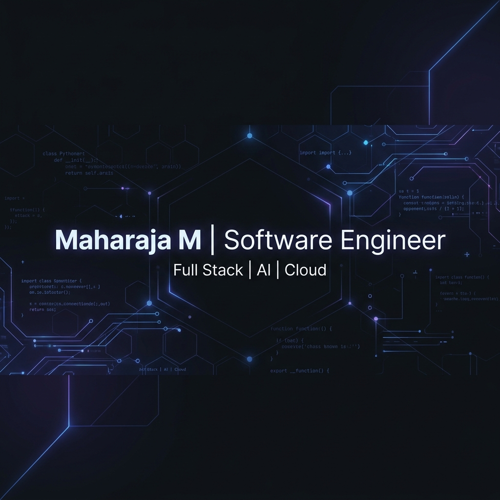

  

 

  <h1>Hi 👋, I'm Maharaja M</h1>
  
  

    
  

  

    
    
    
  

---

## 🧑‍💻 About Me

I am a **final-year Computer Science and Engineering student** at **Government College of Technology, Coimbatore**, with a CGPA of **7.55**. I am highly passionate about backend engineering, building scalable software architectures, and cloud computing. I love solving challenging engineering problems and incorporating AI technologies to build smart applications.

- 🚀 Passionate about building robust, scalable full-stack applications.
- 🧠 Deeply interested in AI, GenAI integration, and cloud-native solutions.
- ⚙️ Love optimizing backend performance and developing clean API interfaces.
- 📚 Continuous learner, adapting to new tech stacks and design methodologies daily.

---

## ⚡ Current Focus

<table width="100%">
  <tr>
    <td width="50%" valign="top">
      <h3>🚀 Active Projects</h3>
      <ul>
        <li><strong>Secure Campus Voting System:</strong> AI-powered secure campus election platform utilizing the MERN stack and Flask.</li>
        <li><strong>Smart Expense Intelligence Platform (SEIP):</strong> An AI-first financial SaaS platform featuring intelligent automation.</li>
        <li><strong>Smart Play Bank AI:</strong> AI-enabled interactive financial literacy platform.</li>
      </ul>
    </td>
    <td width="50%" valign="top">
      <h3>📚 Currently Learning</h3>
      <ul>
        <li>Advanced System Design & Scalability</li>
        <li>Containerization with Docker & Kubernetes</li>
        <li>Cloud Services (AWS, EC2, S3, CloudFront)</li>
        <li>Message Queues & Caching (Redis, BullMQ)</li>
        <li>CI/CD Workflows & Open Source contributions</li>
      </ul>
    </td>
  </tr>
</table>

---

## 🛠️ Tech Stack & Skills

<table width="100%">
  <tr>
    <td valign="top" width="50%">
      <h4>💻 Languages</h4>
      
      
      
      
      
    </td>
    <td valign="top" width="50%">
      <h4>🌐 Frontend</h4>
      
      
      
      
      
    </td>
  </tr>
  <tr>
    <td valign="top" width="50%">
      <h4>⚙️ Backend & DB</h4>
      
      
      
      
       
      
      
      
    </td>
    <td valign="top" width="50%">
      <h4>🧠 AI & Cloud</h4>
      
      
      
       
      
      
      
      
      
    </td>
  </tr>
  <tr>
    <td valign="top" colspan="2">
      <h4>🛠️ Tools, DevOps & Databases</h4>
      
      
      
      
      
      
      
      
    </td>
  </tr>
</table>

---

## 🏆 Featured Projects

<table width="100%">
  <tr>
    <td width="33%" valign="top">
      <h3>🗳️ Secure Campus Voting</h3>
      
AI-powered secure campus election platform utilizing biometric face verification and robust security protocols.

      

        
        
        
      

      <ul>
        <li>Biometric authentication via face recognition APIs.</li>
        <li>Real-time graphical results aggregation.</li>
      </ul>
      

      

        <a href="https://github.com/Maharaja19">📁 Code</a> &nbsp;|&nbsp; <a href="#">🌐 Demo</a>
      

    </td>
    <td width="33%" valign="top">
      <h3>💳 Smart Expense Intel</h3>
      
AI-powered financial intelligence SaaS platform featuring OCR receipt scanning and automated budgeting insights.

      

        
        
        
      

      <ul>
        <li>Automated bill extraction using smart OCR logic.</li>
        <li>Intelligent expense suggestions powered by Gemini.</li>
      </ul>
      

      

        <a href="https://github.com/Maharaja19">📁 Code</a> &nbsp;|&nbsp; <a href="#">🌐 Demo</a>
      

    </td>
    <td width="33%" valign="top">
      <h3>🏦 Smart Play Bank AI</h3>
      
Gamified financial literacy platform designed to teach complex banking concepts using AI-interactive scenarios.

      

        
        
        
      

      <ul>
        <li>Selected for <b>DCKAP Incubation Program</b>.</li>
        <li>Real-time financial queries resolved via AI chat tutor.</li>
      </ul>
      

      

        <a href="https://github.com/Maharaja19">📁 Code</a> &nbsp;|&nbsp; <a href="#">🌐 Demo</a>
      

    </td>
  </tr>
</table>

---

## 🏅 Achievements & Certifications

<table width="100%">
  <tr>
    <td width="50%" valign="top">
      <h3>🌟 Key Achievements</h3>
      <ul>
        <li>💡 <strong>DCKAP Incubation Selection:</strong> Smart Play Bank AI selected for incubation support.</li>
        <li>💼 <strong>Bluekode Internship:</strong> Software Engineering Intern gaining enterprise software exposure.</li>
        <li>🥇 <strong>NPTEL Elite Certificate (84%):</strong> Distinguished performer in advanced programming.</li>
        <li>🌐 <strong>Full-Stack Architect:</strong> Successfully engineered and deployed multiple MERN applications.</li>
        <li>☁️ <strong>Cloud Native Deployments:</strong> Hosted robust server deployments on AWS & Vercel.</li>
      </ul>
    </td>
    <td width="50%" valign="top">
      <h3>📜 Professional Certifications</h3>
      <ul>
        <li>🎓 <strong>IBM DevOps Fundamentals</strong></li>
        <li>🎓 <strong>IBM Cloud Computing</strong></li>
        <li>🎓 <strong>JPMorgan Chase Software Engineering</strong> (Job Simulation)</li>
        <li>🎓 <strong>NPTEL Joy of Computing Using Python</strong></li>
        <li>🎓 <strong>EBPL GenAI Internship Certificate</strong></li>
      </ul>
    </td>
  </tr>
</table>

---

## 📊 GitHub Analytics

<table align="center" width="100%">
  <tr>
    <td width="50%" align="center">
      
    </td>
    <td width="50%" align="center">
      
    </td>
  </tr>
  <tr>
    <td width="50%" align="center">
      
    </td>
    <td width="50%" align="center">
      
    </td>
  </tr>
</table>

 

  

---

## 🗓️ Learning & Professional Timeline

<table width="100%">
  <thead>
    <tr>
      <th align="center" width="15%">Year</th>
      <th align="left" width="35%">Milestone / Position</th>
      <th align="left" width="50%">Key Contributions & Impact</th>
    </tr>
  </thead>
  <tbody>
    <tr>
      <td align="center"><strong>2023</strong></td>
      <td>Started B.E. CSE at GCT Coimbatore</td>
      <td>Began my computational engineering foundation in Computer Science and Engineering.</td>
    </tr>
    <tr>
      <td align="center"><strong>2025</strong></td>
      <td>Treasurer, CSEA & NPTEL Elite</td>
      <td>Elected Treasurer of the Computer Science Engineering Association; earned Elite ranking (84%) in NPTEL.</td>
    </tr>
    <tr>
      <td align="center"><strong>2026</strong></td>
      <td>Bluekode Intern & IBM Certified</td>
      <td>Interned at Bluekode; secured DevOps and Cloud certifications from IBM; selected for DCKAP Incubation. Developed Secure Campus Voting System, SEIP, and Smart Play Bank AI.</td>
    </tr>
  </tbody>
</table>

---

## 🐍 Contribution Snake

  <picture>
    <source media="(prefers-color-scheme: dark)" srcset="https://raw.githubusercontent.com/Maharaja19/Maharaja19/output/github-contribution-grid-snake-dark.svg" />
    <source media="(prefers-color-scheme: light)" srcset="https://raw.githubusercontent.com/Maharaja19/Maharaja19/output/github-contribution-grid-snake.svg" />
    
  </picture>

---

## 💡 Fun Facts

* ⚡ I enjoy optimization challenges and making database queries run lighting-fast.
* 🤖 Deeply intrigued by the future of Agentic AI workflows and LLM orchestration.
* 🍕 When not writing code, I am exploring system architectures or reading technical blogs.

---

## 🔗 Connect with Me

  
  
  
  
  
  

 

  
<em>Thank you for visiting my profile! I am always open to learning, collaboration, and software engineering opportunities. Let's build something scalable!</em>

